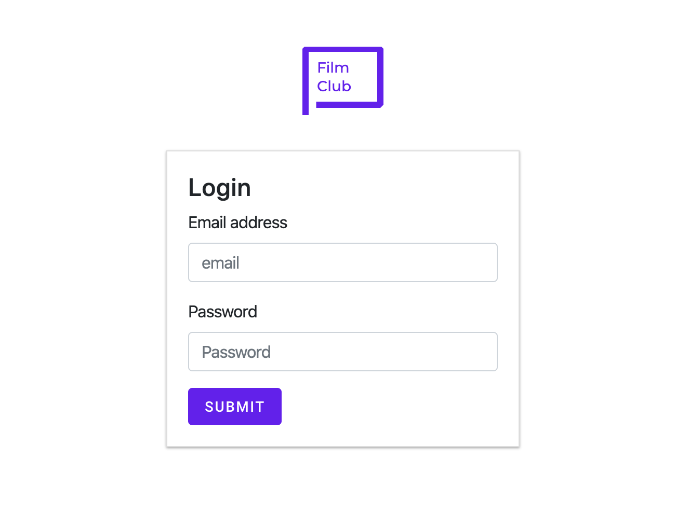
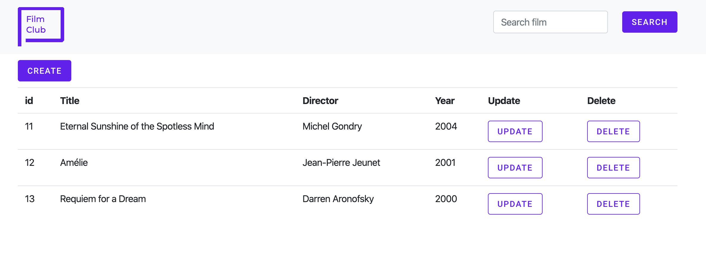
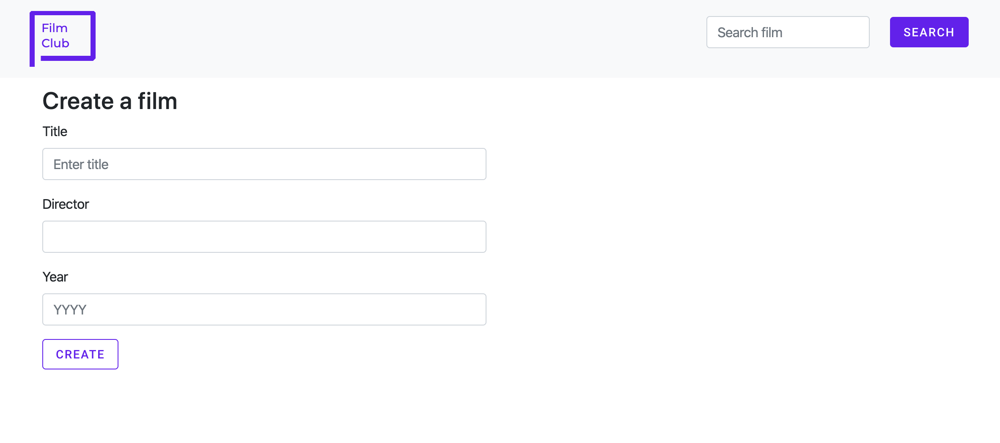
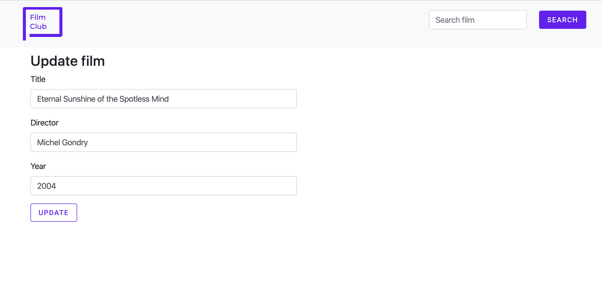
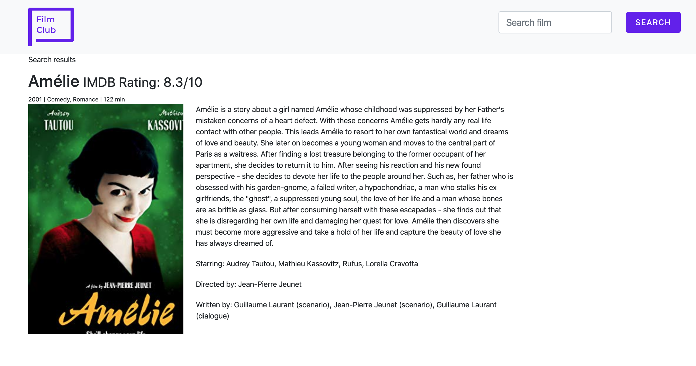

### Big Project: Data Rep

For this project I used: Flask, PyMySQL, Jquery, REST API, AJAX call and linking to a third party API.

```
python3 -m pip install PyMySQL
```

I used a mixture of Bootstrap and Material design for the layout and styling via CDN.

Bootstrap: https://getbootstrap.com/

Material Design: https://material.io/develop/

```
  <script src="https://ajax.googleapis.com/ajax/libs/jquery/3.4.1/jquery.min.js"></script>
  <link rel="stylesheet" href="https://stackpath.bootstrapcdn.com/bootstrap/4.3.1/css/bootstrap.min.css" integrity="sha384-ggOyR0iXCbMQv3Xipma34MD+dH/1fQ784/j6cY/iJTQUOhcWr7x9JvoRxT2MZw1T" crossorigin="anonymous">
  <link href="https://unpkg.com/material-components-web@latest/dist/material-components-web.min.css" rel="stylesheet">
  <script src="https://unpkg.com/material-components-web@latest/dist/material-components-web.min.js"></script>
```

### The site is hosted on pythonanywhere: http://rraher.pythonanywhere.com/login


#### To login 

```
email: rita@gmail.com

password: MMAA
```


### Project Details

The project consists of a login screen which check the database to see if the user exists and that the password and email address are correct before bringing the user to the main page.

http://rraher.pythonanywhere.com/login



The table fetches a few films from the database using PyMySQL, REST API and AJAX calls.

http://rraher.pythonanywhere.com/filmviewer



A create feature using Jquery, PyMySQL, REST API and AJAX calls.


An update feature using Jquery, PyMySQL, REST API and AJAX calls.


An delete function that removes the film from the database.

The Search is hooked in to a third party api www.omdbapi.com and returns search results from the api. The OMDb API is a RESTful web service to obtain movie information, all content and images on the site are contributed and maintained by their users.

http://rraher.pythonanywhere.com/film/search/Am%C3%A9lie




The project contains 3 DAO files

- zfilmDAO.py

Contains sql queries to the film table

- zUserDAO.py

Contains sql queries to the user table

- zfilmdatabaseDAO.py

Contains api calls to www.omdbapi.com